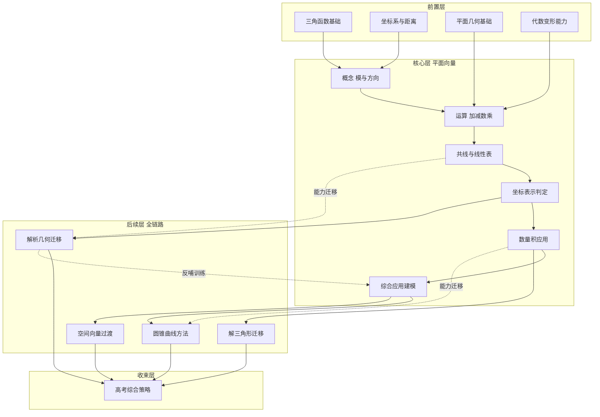

# 平面向量学习路径图（高中生自学｜全链路版）

适用对象：高中生自学（考试与提分导向）  
使用方式：先看总览图定位当前位置，再按阶段清单逐项完成。

## 一、学习路径总览（Mermaid）

图例说明：
- 实线：主学习路径（必须完成）
- 虚线：能力迁移路径（进阶强化）

## 二、分阶段学习清单（可执行）

### 阶段 0：前置诊断与补齐（1-3 天）

| 项目 | 内容 |
|---|---|
| 阶段目标 | 补齐进入平面向量前的最低能力，避免后续卡在计算和判定。 |
| 必会方法 | 三角函数基本值与诱导公式；两点距离；平行垂直基本性质；代数恒等变形。 |
| 典型题型 | 已知角求三角值；已知两点求距离；几何关系转代数条件；分式/根式化简。 |
| 达标标准 | 20 分钟内完成 10 道基础小题，正确率至少 80%。 |

### 阶段 1：概念与运算（第 1 周）

| 项目 | 内容 |
|---|---|
| 阶段目标 | 建立向量对象意识，熟练完成加减、数乘、线性表示。 |
| 必会方法 | 向量相等判定；共线定理；平行四边形法则；向量方程基本变形。 |
| 典型题型 | 用向量表示线段关系；证明三点共线；点分问题；中点与重心表示。 |
| 达标标准 | 30 分钟内完成 8 道运算+证明基础题，正确率至少 75%。 |

### 阶段 2：坐标化与数量积（第 2 周）

| 项目 | 内容 |
|---|---|
| 阶段目标 | 完成从几何直观到代数计算的迁移，掌握夹角、垂直、长度统一求法。 |
| 必会方法 | 向量坐标表示；模长公式；数量积公式；平行垂直坐标判定。 |
| 典型题型 | 求夹角；判定垂直平行；最值初步（配方/参数）；长度关系证明。 |
| 达标标准 | 数量积与坐标综合题 6 道，至少 5 道一次做对。 |

### 阶段 3：平面向量综合应用（第 3 周）

| 项目 | 内容 |
|---|---|
| 阶段目标 | 形成“建系-设向量-运算-回译”的完整解题闭环。 |
| 必会方法 | 几何条件向量化；参数法；向量法证明平行垂直；最值与轨迹建模。 |
| 典型题型 | 证明题（平行/垂直/共点）；最值题；轨迹题；参数取值范围题。 |
| 达标标准 | 限时 45 分钟完成 2 道综合大题，过程完整且关键步骤无跳步。 |

### 阶段 4：后续迁移与高考整合（第 4 周）

| 项目 | 内容 |
|---|---|
| 阶段目标 | 把平面向量方法迁移到解三角形、解析几何、圆锥曲线和空间向量。 |
| 必会方法 | 方向向量/法向量；向量化夹角距离；平面到空间符号迁移。 |
| 典型题型 | 直线圆锥曲线中的向量条件；空间线面关系向量化；综合压轴拼接题。 |
| 达标标准 | 近 3 年综合题中，向量相关子问得分率达到 70% 以上。 |

## 三、常见误区与纠偏

| 高频误区 | 表现 | 纠偏动作 |
|---|---|---|
| 把向量当纯数字算 | 乱做“除法”或忽略方向 | 每步标注“量类型”：长度/向量/标量，禁止跨类型运算。 |
| 数量积符号混乱 | 公式会背但代入常错号 | 先写标准式 `a·b=|a||b|cosθ`，再代数化，最后统一检查正负。 |
| 几何图不建系 | 题目看懂但算不动 | 先定原点和基向量，再写点坐标，强制进入坐标化流程。 |
| 共线判定单一 | 只会比例法，遇参数题卡住 | 同时练“b=λa”和坐标行列式法，按题型切换。 |
| 只刷结论不练回译 | 算出式子但答非所问 | 每题最后加一步“几何回译”：把代数结论翻译回图形关系。 |
| 空间迁移断层 | 平面会做，空间不会下手 | 先用同一题型做平面版，再做空间版，保留同样四步模板。 |

## 四、4 周执行节奏（主方案）

| 周次 | 学习重点 | 每日任务（建议 60-90 分钟） | 周末验收 |
|---|---|---|---|
| 第 1 周 | 概念与线性运算 | 30 分钟知识点复盘 + 30 分钟基础题 + 10 分钟错因记录 | 1 套基础卷，定位薄弱点 |
| 第 2 周 | 坐标化与数量积 | 20 分钟公式训练 + 40 分钟专项题 + 15 分钟复盘 | 1 套数量积综合小卷 |
| 第 3 周 | 综合应用题 | 45 分钟限时大题 + 20 分钟对答案重做 + 10 分钟归纳模板 | 2 道大题完整书写 |
| 第 4 周 | 全链路迁移 | 30 分钟迁移训练（解析/空间）+ 30 分钟真题 + 15 分钟纠错 | 近年真题专题测评 |

## 五、2 周冲刺版（可选）

| 时间 | 安排 |
|---|---|
| 第 1 周 | 前置查漏半天 + 概念运算 2 天 + 坐标与数量积 3 天 + 阶段测 1 天 |
| 第 2 周 | 综合应用 3 天 + 解析/空间迁移 2 天 + 真题压轴与复盘 2 天 |

冲刺要求：
- 每天至少 1 次限时训练（20-45 分钟）
- 每天至少 1 次错题重做（不看答案）
- 每 2 天更新一次“易错清单”并回炉

## 六、自检清单（交付验收）

- Mermaid 图在 Markdown 渲染器可正常显示。
- 主图无断链、无孤立节点、无循环依赖。
- 核心层每个节点都能对应到“必会方法 + 典型题型”。
- 路径中明确给出“平面向量 -> 空间向量”衔接。
- 误区条目至少 5 条且都包含可执行纠偏动作。
